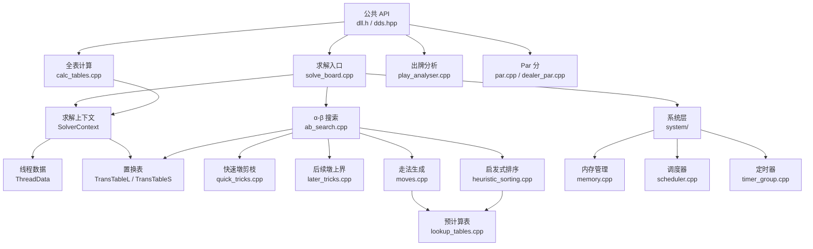

# DDS 架构分析与重构计划

## 一、项目概述

DDS（Double Dummy Solver）是一个桥牌双明手分析求解器，核心功能是计算给定牌局中某方能赢取的最大墩数。它支持多线程（STL/OpenMP 多种后端）、跨平台（Windows / Linux / macOS），同时提供 C API 和 C++ API。

当前版本：**v3.0（开发中）**，已从 v2.9.0 遗留代码迁移至现代 C++20 + Bazel 构建体系。

---

## 二、目录结构一览

```
library/src/
├── api/                      公共 C/C++ API 头文件
│   ├── dll.h                 C API 声明 (DLLEXPORT)
│   ├── dds.h                 内部核心数据结构
│   ├── solve_board.hpp       C++ 求解接口
│   ├── calc_dd_table.hpp     全牌局 DD 表接口
│   └── calc_par.hpp          Par 分接口
├── solver_context/           求解上下文（线程级状态容器）
├── trans_table/              置换表（Transposition Table）
├── system/                   线程/内存/调度/定时器抽象
├── moves/                    走法生成
├── heuristic_sorting/        启发式走法排序
├── lookup_tables/            预计算查找表
├── utility/                  常量、调试工具
├── ab_search.cpp/hpp         α-β 搜索核心
├── solve_board.cpp/hpp       求解入口
├── quick_tricks.cpp/hpp      快速墩剪枝
├── later_tricks.cpp/hpp      后续墩上界估算
├── calc_tables.cpp/hpp       全套牌面（5 种将牌）计算
├── play_analyser.cpp/hpp     出牌序列分析
├── par.cpp                   Par 分计算
├── pbn.cpp/hpp               PBN 格式解析
└── dds.hpp / dds.cpp         C++ 公共入口
```

---

## 三、核心数据结构

### 3.1 牌面表示

```
Pos（递归搜索的当前局面）
├── rank_in_suit[4][4]   uint16, 每手每花色的持牌位掩码
├── aggr[4]              uint16, 每花色所有牌的聚合位掩码
├── length[4][4]         uint8,  每手每花色的牌数
├── hand_dist[4]         int,    每手总牌数
├── win_ranks[50][4]     uint16, 各深度可赢的牌（按 rank）
├── first[50]            int,    各层的出牌手
├── move[50]             MoveType, 各层当前最佳走法
├── tricks_max           int,    最大化方赢得的墩数累计
├── winner[4]            HighCardType, 各花色当前赢家
└── second_best[4]       HighCardType, 各花色第二高牌
```

| 结构 | 大小 | 说明 |
|---|---|---|
| `NodeCards` | 8 字节 | TT 缓存项：上界/下界/最佳走法/最低赢牌 |
| `MoveType` | 16 字节 | 走法：花色/点数/序列标志/排序权重 |
| `ThreadData` | ~1 MB | 每线程数据：含 960 KB `rel[]` 相对 rank 数组 |
| `WinMatch` (TT-L) | 52 字节 | 大置换表单条记录 |
| `WinBlock` (TT-L) | ~6.5 KB | 大置换表块（125 条记录） |

---

## 四、模块架构与调用关系



---

## 五、α-β 搜索详解

核心算法为 **Negamax α-β 搜索**，针对桥牌出牌顺序拆分为四个变体：

| 函数 | 适用阶段 | 说明 |
|---|---|---|
| `ab_search()` / `ab_search_0()` | 庄家出牌（hand_rel_first == 0） | 生成所有合法走法 |
| `ab_search_1()` | 第二家跟牌 | 基于首家出牌生成跟牌 |
| `ab_search_2()` | 第三家跟牌 | 考虑第一、二家牌面 |
| `ab_search_3()` | 第四家跟牌 | 最后一手，完成一墩 |

每个节点的处理流程：

```
ab_search_N(pos, target, depth, ctx)
  1. TT 查找：ctx.tt().lookup(pos) → 命中则直接返回
  2. QuickTricks(pos, ..., ctx) → 快速剪枝（若能保证达到/无法达到 target）
  3. LaterTricksMAX/MIN(pos, ..., ctx) → 上界/下界剪枝
  4. MoveGen0/123() → 生成合法走法列表
  5. call_heuristic(HeuristicContext) → 走法排序（权重赋值）
  6. 按权重遍历走法：
       make_N(pos, depth, move)     → 状态前进
       ab_search_{N+1}(...)         → 递归
       undo_N(pos, depth, move)     → 状态回退
  7. TT 存储：ctx.tt().add(pos, result)
  8. 返回 bool（是否达到 target）
```

搜索深度 `depth` 的语义：`depth = tricks_remaining * 4 - current_hand_in_trick`，最大 `52`（13 墩 × 4）。

---

## 六、置换表（Transposition Table）

提供两种实现，统一继承自 `TransTable` 抽象基类：

| | TransTableL（大表） | TransTableS（小表） |
|---|---|---|
| 默认内存 | 95 MB/线程 | 20 MB/线程 |
| 最大内存 | 160 MB/线程 | 30 MB/线程 |
| 架构 | 分页池 + LRU 淘汰 | 简单哈希表 |
| 索引 | trick × hand × suit-dist hash | 简化哈希 |
| 适用场景 | 内存充足，追求速度 | 内存紧张 |

哈希命中后返回 `NodeCards`（8 字节），包含上界、下界、最佳走法花色/点数、各花色最低赢牌。

---

## 七、多线程模型

### 现有实现

```
SolveAllBoards(bds, solved)
  └── solve_all_boards_n()
        ├── Scheduler::RegisterRun()    → 按花色/哈希分组，减少 TT 污染
        ├── std::atomic<int> next_board → 无锁工作窃取
        └── std::jthread × N           → 每线程独立 SolverContext
              └── SolveBoard(deal, ...) → 单局求解（每线程独立 TT）
```

- 线程数 = `min(hardware_concurrency, board_count)`
- 每线程拥有独立的 `SolverContext`（含 `ThreadData` + `TransTable`），**无线程间共享可变状态**
- `Scheduler` 按相似局面分组，降低不同局面污染同一线程 TT 的概率

---

## 八、性能热路径分析

根据代码结构推断主要热路径（需 VTune 实测确认）：

1. **`ab_search_*` 递归调用**：占总时间约 80–90%
   - 每局约产生 $10^5$–$10^8$ 个节点
   - 函数调用栈深度最大 52

2. **置换表访问**（每节点 1 次查找 + 可能 1 次存储）
   - `NodeCards`（8B）在大表中分布于 ~100 MB 内存，L3 缓存命中率关键

3. **相对 rank 计算**（`rel[]` 数组）
   - `ThreadData::rel[8192]`（960 KB）在每次走法生成时访问
   - 超出 L1/L2 缓存，造成大量 L3 访问

4. **启发式排序** `call_heuristic()`
   - 每节点调用一次，分支较多的位操作

5. **走法生成** `MoveGen0/123()`
   - 依赖预计算查找表（`lookup_tables`）

---

## 九、重构方向与 Intel oneAPI 加速方案

### 9.1 总体重构原则

- **不改变算法逻辑**：α-β 搜索已是理论最优，重构聚焦于工程质量和硬件利用率
- **以性能测量为导向**：先用 VTune / perf 建立基准，再按 hotspot 优先级逐步优化
- **保持 API 兼容**：`dll.h` C API 和 `dds.hpp` C++ API 接口不变

---

### 9.2 Intel oneAPI 加速方案

#### 9.2.1 Intel oneTBB — 替换线程调度层

**现状**：手写 `std::jthread` 工作窃取 + `Scheduler` 分组

**方案**：

```cpp
// 当前
std::vector<std::jthread> threads;
for (int i = 0; i < nthreads; ++i)
    threads.emplace_back(worker);

// 替换为 oneTBB
#include <tbb/parallel_for_each.h>
#include <tbb/task_arena.h>

tbb::task_arena arena(nthreads);
arena.execute([&] {
    tbb::parallel_for_each(board_indices.begin(), board_indices.end(), worker);
});
```

**收益**：
- TBB 工作窃取调度器对不均衡任务（各局求解时间差异大）比固定线程池更高效
- `task_arena` 支持 NUMA 感知线程绑定，减少跨 NUMA 内存访问
- `tbb::concurrent_queue` 可替代 `std::atomic<int>` 计数器方案

**改动文件**：`library/src/solve_board.cpp`，`library/src/system/system.hpp`

---

#### 9.2.2 Intel SIMD 内联函数 — 加速牌面位操作

**现状**：`rank_in_suit[4][4]`（16 个 `uint16`，共 32 字节）逐元素处理

**方案**：将 4×4 持牌矩阵打包进 256 位 AVX2 寄存器，一次处理全部花色：

```cpp
// 使用 AVX2 同时处理 4 手 × 4 花色
#include <immintrin.h>

// 打包 rank_in_suit[4][4] → __m256i（每 uint16 占一个 lane）
inline __m256i load_holdings(const unsigned short rank_in_suit[4][4]) {
    return _mm256_loadu_si256(reinterpret_cast<const __m256i*>(rank_in_suit));
}

// 并行按位 AND：检查某手是否有某花色的牌
inline int any_cards_avx(const __m256i holdings, const __m256i mask) {
    return !_mm256_testz_si256(holdings, mask);
}

// 快速墩估算：popcount 全花色持牌数
inline void count_all_suits_avx(const __m256i holdings, int out[4]) {
    // 拆解后用 _mm_popcnt_u32
}
```

**适用热点**：
- `QuickTricks()` 中对各花色持牌的检查循环
- `MoveGen` 中 `suit[4][4]` 的遍历
- `aggr[]` 聚合位掩码更新（可用 `_mm256_or_si256`）

**改动文件**：`library/src/quick_tricks.cpp`，`library/src/moves/moves.cpp`

---

#### 9.2.3 Intel VTune Profiler — 性能基准与热点定位

在优化前后用 VTune 建立量化基准：

```bash
# 构建 profiling build
bazel build -c opt //library/tests:dtest

# VTune hotspot 分析
vtune -collect hotspots -result-dir vtune_hs -- \
    ./bazel-bin/library/tests/dtest -f hands/list100.txt -s solve -n 8

# VTune 内存访问分析（定位 TT cache miss）
vtune -collect memory-access -result-dir vtune_mem -- \
    ./bazel-bin/library/tests/dtest -f hands/list100.txt -s solve -n 8

# 查看报告
vtune -report hotspots -result-dir vtune_hs
```

**关键指标**：
- `ab_search_*` 函数的 CPI（Cycles Per Instruction）
- 置换表访问的 L3 cache miss rate
- `rel[]` 数组的 DRAM bandwidth 消耗

---

#### 9.2.4 Intel icx/icpx 编译器 — 自动优化

**方案**：将 Bazel 工具链切换至 Intel oneAPI C++ 编译器：

```python
# .bazelrc 添加
build:intel --repo_env=CC=icx
build:intel --repo_env=CXX=icpx

# CPPVARIABLES.bzl 添加 Intel 特定优化标志
DDS_INTEL_OPTS = [
    "-O3",
    "-ipo",                    # 跨文件过程间优化（IPO）
    "-xHost",                  # 针对当前 CPU 自动选择最优 SIMD 指令集
    "-qopt-report=5",          # 输出优化报告（查看哪些循环被向量化）
    "-prof-gen",               # PGO 第一阶段：生成 profiling instrumentation
]
```

**PGO 工作流**：

```bash
# 第一步：构建插桩版本
bazel build --config=intel //library/tests:dtest

# 第二步：用代表性负载生成 profile
./bazel-bin/library/tests/dtest -f hands/list1000.txt -s solve -n 8

# 第三步：用 profile 重新构建优化版本
# 在 CPPVARIABLES.bzl 中将 -prof-gen 换为 -prof-use
bazel build --config=intel -c opt //...
```

---

#### 9.2.5 置换表内存布局优化

**现状**：`TransTableL` 使用分页+链式块（`WinBlock` 6.5KB，`WinMatch` 52字节），访问模式随机

**方案 A：缓存行对齐**

```cpp
// 当前 NodeCards 8 字节，多个可能跨缓存行
struct alignas(64) NodeCardsCacheLine {
    NodeCards entries[8];  // 8 × 8B = 64B，恰好一个缓存行
    uint32_t tags[8];      // 存储 position hash 用于快速比较
};
```

**方案 B：Two-level hash（借鉴 Stockfish）**

将大表改为两级：第一级 L2/L3 大小的直接映射表（快速），第二级完整大表（兜底），减少平均访问延迟。

**方案 C：Intel Memory Latency Checker 测量**

```bash
mlc --bandwidth_matrix    # 测量 NUMA 带宽矩阵
mlc --latency_matrix      # 测量跨 NUMA 延迟
```

用测量结果指导 TT 的内存分配策略（是否使用 `mmap` + `MADV_HUGEPAGE`）。

---

#### 9.2.6 oneTBB concurrent_hash_map — 实验性多线程共享 TT

**背景**：当前每线程各有独立 TT，跨线程无法共享缓存（同一局面被多线程重复计算）

**实验方向**：

```cpp
#include <tbb/concurrent_hash_map.h>

// 将 TT 改为全局共享（需评估锁竞争 vs 重复计算的 trade-off）
tbb::concurrent_hash_map<uint64_t, NodeCards> shared_tt;
```

**注意**：共享 TT 会引入锁竞争，需在实测后决策。建议先用 `-n 8` 和 `-n 16` 线程数对比命中率。

---

### 9.3 重构优先级排序

| 优先级 | 方案 | 预期收益 | 风险 | 工作量 |
|:---:|---|---|---|---|
| 🔴 P0 | VTune 性能基准建立 | 量化热点，指导后续工作 | 低 | 小 |
| 🔴 P0 | Intel icpx + `-xHost` + IPO | 5–15% 全局提升，零代码改动 | 低 | 小 |
| 🟠 P1 | oneTBB 替换线程调度 | 不均衡任务调度效率提升 | 中 | 中 |
| 🟠 P1 | AVX2 牌面位操作 | QuickTricks/MoveGen 加速 20–40% | 中 | 中 |
| 🟡 P2 | TT 缓存行对齐 | 降低 TT cache miss | 低 | 小 |
| 🟡 P2 | PGO 编译优化 | 分支预测 + 内联改善 5–10% | 低 | 中 |
| 🟢 P3 | 共享 TT 实验 | 多线程 TT 命中率提升 | 高 | 大 |
| 🟢 P3 | NUMA 感知内存分配 | 多路服务器场景受益 | 中 | 大 |

---

### 9.4 重构实施步骤

```
阶段 0：基准建立（不改代码）
  ├── 用 list1000.txt 建立 baseline（时间 / 节点数 / TT 命中率）
  └── VTune hotspot + memory-access 报告

阶段 1：编译器优化（改 BUILD/bazelrc，不改源码）
  ├── 切换 icpx 工具链
  ├── 启用 -xHost -ipo
  └── 建立 PGO profile，重测基准

阶段 2：oneTBB 线程调度（改 solve_board.cpp + system/）
  ├── 引入 tbb::task_arena + parallel_for_each
  ├── 保持 Scheduler 分组逻辑（仅替换底层 jthread）
  └── 验证正确性 + 性能回归测试

阶段 3：SIMD 位操作（改 quick_tricks.cpp + moves.cpp）
  ├── 封装 AVX2 helpers（条件编译，fallback 到标量）
  ├── 单元测试覆盖新路径
  └── 性能对比

阶段 4：TT 布局优化
  ├── 缓存行对齐 NodeCards
  ├── 用 VTune 验证 cache miss 改善
  └── 考虑 Two-level hash 方案

阶段 5：共享 TT 实验（可选，风险最高）
  ├── 小规模 POC：2 线程共享 TT
  └── 评估锁竞争 vs 命中率，决策是否推广
```

---

## 十、现有代码质量问题

| 问题 | 位置 | 建议 |
|---|---|---|
| `ThreadData` 过于庞大（~1MB 含 960KB `rel[]`） | `system/thread_data.hpp` | 将 `rel[]` 改为懒初始化或按需分配 |
| `extern Memory memory; extern Scheduler scheduler;` 全局状态 | `solve_board.cpp` | 迁移进 `SolverContext`（已在进行中） |
| `dll.h` 在 `__clang__` 下禁用 `DLLEXPORT` | `api/dll.h` | 已知问题，icpx 也受影响（见 user memory） |
| `TransTableL::WinMatch` 52 字节未对齐 | `trans_table/trans_table_l.hpp` | 加 `alignas(8)` 或重排字段 |
| `ab_search_*` 四个几乎相同的函数 | `ab_search.cpp` | 模板化/合并，减少维护负担 |
| `using namespace std;` 在头文件 | `system/system.hpp` | 移除，改用显式 `std::` 前缀 |

---

## 十一、构建与测试

```bash
# 基础构建与测试
bazel build //...
bazel test //...

# 优化构建
bazel build -c opt //...

# Intel oneAPI 构建（配置工具链后）
bazel build --config=intel -c opt //...

# 运行基准测试
bazel build -c opt //library/tests:dtest
./bazel-bin/library/tests/dtest -f hands/list1000.txt -s solve -n 8

# ASAN 内存安全检查
bazel test --define=asan=true //library/tests:...
```

---

## 十二、参考资料

- [Intel oneAPI TBB 文档](https://www.intel.com/content/www/us/en/docs/onetbb/developer-guide/current/overview.html)
- [Intel VTune Profiler](https://www.intel.com/content/www/us/en/docs/vtune-profiler/user-guide/current/overview.html)
- [Intel icx/icpx 编译器](https://www.intel.com/content/www/us/en/developer/tools/oneapi/dpc-compiler.html)
- [AVX2 Intrinsics Guide](https://www.intel.com/content/www/us/en/docs/intrinsics-guide/index.html)
- [Stockfish TT 设计](https://github.com/official-stockfish/Stockfish) — 棋牌引擎置换表参考
- [DDS 原始论文/文档](doc/dll-description.md)
