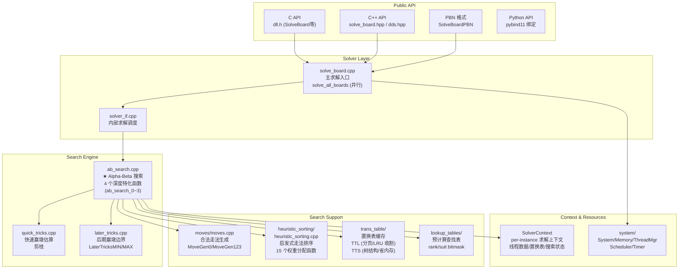

Optimized tool selection

Created 4 todos

Read [](file:///e%3A/workspace/BridgeMaster-dds-refactor/public/dds/library/src)

Read [](file:///e%3A/workspace/BridgeMaster-dds-refactor/public/dds/STRUCTURE.md)

Read [](file:///e%3A/workspace/BridgeMaster-dds-refactor/public/dds/MODULE.bazel)

Read [](file:///e%3A/workspace/BridgeMaster-dds-refactor/public/dds/BUILD.bazel#1-1), lines 1 to 100

Read [](file:///e%3A/workspace/BridgeMaster-dds-refactor/public/dds/library/src/BUILD.bazel)

Read [](file:///e%3A/workspace/BridgeMaster-dds-refactor/public/dds/library/src/api)

Read [](file:///e%3A/workspace/BridgeMaster-dds-refactor/public/dds/library/src/trans_table)

Read [](file:///e%3A/workspace/BridgeMaster-dds-refactor/public/dds/library/src/moves)

Read [](file:///e%3A/workspace/BridgeMaster-dds-refactor/public/dds/library/src/heuristic_sorting)

Read [](file:///e%3A/workspace/BridgeMaster-dds-refactor/public/dds/library/src/solver_context)

Read [](file:///e%3A/workspace/BridgeMaster-dds-refactor/public/dds/library/src/system)

Read [](file:///e%3A/workspace/BridgeMaster-dds-refactor/public/dds/library/src/lookup_tables)

Read [](file:///e%3A/workspace/BridgeMaster-dds-refactor/public/dds/library/src/utility)

Read [](file:///e%3A/workspace/BridgeMaster-dds-refactor/public/dds/library/src/ab_search.hpp)

Read [](file:///e%3A/workspace/BridgeMaster-dds-refactor/public/dds/library/src/moves/moves.hpp#1-1), lines 1 to 100

Read [](file:///e%3A/workspace/BridgeMaster-dds-refactor/public/dds/library/src/ab_search.cpp#1-1), lines 1 to 150

Read [](file:///e%3A/workspace/BridgeMaster-dds-refactor/public/dds/library/src/solve_board.hpp)

Read [](file:///e%3A/workspace/BridgeMaster-dds-refactor/public/dds/library/src/solver_context/solver_context.hpp#1-1), lines 1 to 100

Read [](file:///e%3A/workspace/BridgeMaster-dds-refactor/public/dds/library/src/trans_table/trans_table.hpp#1-1), lines 1 to 100

Read [](file:///e%3A/workspace/BridgeMaster-dds-refactor/public/dds/library/src/heuristic_sorting/heuristic_sorting.hpp)

Read [](file:///e%3A/workspace/BridgeMaster-dds-refactor/public/dds/library/src/later_tricks.hpp)

Read [](file:///e%3A/workspace/BridgeMaster-dds-refactor/public/dds/library/src/quick_tricks.hpp)

Read [](file:///e%3A/workspace/BridgeMaster-dds-refactor/public/dds/library/src/solver_if.hpp)

Read [](file:///e%3A/workspace/BridgeMaster-dds-refactor/public/dds/library/src/system/system.hpp#1-1), lines 1 to 80

Read [](file:///e%3A/workspace/BridgeMaster-dds-refactor/public/dds/library/src/api/dds.h#1-1), lines 1 to 100

Read [](file:///e%3A/workspace/BridgeMaster-dds-refactor/public/dds/library/src/api/dll.h#1-1), lines 1 to 100

Read [](file:///e%3A/workspace/BridgeMaster-dds-refactor/public/dds/library/src/ab_search.cpp#100-100), lines 100 to 120

Read [](file:///e%3A/workspace/BridgeMaster-dds-refactor/public/dds/library/src/solve_board.cpp#1-1), lines 1 to 120

Read [](file:///e%3A/workspace/BridgeMaster-dds-refactor/public/dds/library/src/heuristic_sorting/heuristic_sorting.cpp#1-1), lines 1 to 100

Read [](file:///e%3A/workspace/BridgeMaster-dds-refactor/public/dds/library/src/trans_table/trans_table_l.hpp#1-1), lines 1 to 80

Read [](file:///e%3A/workspace/BridgeMaster-dds-refactor/public/dds/library/src/quick_tricks.cpp#1-1), lines 1 to 50

Read [](file:///e%3A/workspace/BridgeMaster-dds-refactor/public/dds/library/src/later_tricks.cpp#1-1), lines 1 to 50

Read [](file:///e%3A/workspace/BridgeMaster-dds-refactor/public/dds/library/src/moves/moves.cpp#1-1), lines 1 to 60

Read [](file:///e%3A/workspace/BridgeMaster-dds-refactor/public/dds/library/src/play_analyser.hpp)

Read [](file:///e%3A/workspace/BridgeMaster-dds-refactor/public/dds/library/src/trans_table/trans_table_l.cpp#1-1), lines 1 to 60

Read [](file:///e%3A/workspace/BridgeMaster-dds-refactor/public/dds/library/src/par.cpp#1-1), lines 1 to 80

Read [](file:///e%3A/workspace/BridgeMaster-dds-refactor/public/dds/library/src/ab_stats.hpp#1-1), lines 1 to 50

Read [](file:///e%3A/workspace/BridgeMaster-dds-refactor/public/dds/library/src/lookup_tables/lookup_tables.hpp#1-1), lines 1 to 50

Read [](file:///e%3A/workspace/BridgeMaster-dds-refactor/public/dds/python)

Read [](file:///e%3A/workspace/BridgeMaster-dds-refactor/public/dds/library/tests)

Read [](file:///e%3A/workspace/BridgeMaster-dds-refactor/public/dds/doc/heuristic-sorting.md#1-1), lines 1 to 80

Read [](file:///e%3A/workspace/BridgeMaster-dds-refactor/public/dds/CPPVARIABLES.bzl#1-1), lines 1 to 50

Read [](file:///e%3A/workspace/BridgeMaster-dds-refactor/public/dds/python/dds3)

Read [](file:///e%3A/workspace/BridgeMaster-dds-refactor/public/dds/library/src/system/thread_mgr.hpp#1-1), lines 1 to 60

Read [](file:///e%3A/workspace/BridgeMaster-dds-refactor/public/dds/library/src/system/memory.hpp#1-1), lines 1 to 60

Read [](file:///e%3A/workspace/BridgeMaster-dds-refactor/public/dds/library/src/api/solve_board.hpp)

Read [](file:///e%3A/workspace/BridgeMaster-dds-refactor/public/dds/library/src/trans_table/trans_table_s.hpp#1-1), lines 1 to 80

Read [](file:///e%3A/workspace/BridgeMaster-dds-refactor/public/dds/python/dds3/__init__.py#1-1), lines 1 to 10

Starting: *Write comprehensive analysis* (4/4)

Completed: *Write comprehensive analysis* (4/4)

---

# DDS（Double Dummy Solver）项目分析报告

## 一、项目概述

**DDS** 是一个桥牌双明手求解器（Double Dummy Solver），用 **C++20** 编写，由 Bo Haglund 和 Soren Hein 开发（2006-2018）。它计算给定一手桥牌中，某一方在最佳攻防下能获得的最大赢墩数。当前正在向 **v3.0** 重构中。

**构建系统**: Bazel 7.x（已废弃原 Makefile）
**支持平台**: Windows、Linux、macOS（通过 LLVM/Clang 工具链）
**版本号**: 3.0.1

---

## 二、项目目录结构

```
dds/                                    # 仓库根目录
├── BUILD.bazel                         # 根构建目标（doxygen等）
├── MODULE.bazel                        # Bazel 模块声明 + 外部依赖
├── CPPVARIABLES.bzl                    # 全局 C++ 编译/链接标志
├── .bazelrc                            # Bazel 配置
├── library/
│   ├── src/                            # ★ 核心库源码（~50个源文件）
│   │   ├── api/                        # 公共 API 头文件
│   │   │   ├── dds.h                  # 内部数据结构定义
│   │   │   ├── dll.h                  # C API 声明
│   │   │   ├── solve_board.hpp        # C++ solver 接口
│   │   │   ├── PBN.h                  # PBN 格式支持
│   │   │   ├── portab.h               # 可移植性宏
│   │   │   ├── calc_dd_table.hpp      # DD表计算 API
│   │   │   └── calc_par.hpp           # Par 计算 API
│   │   ├── solver_context/            # 求解器上下文管理
│   │   ├── trans_table/               # 置换表（Transposition Table）
│   │   │   ├── trans_table.hpp        # 抽象基类
│   │   │   ├── trans_table_l.*        # 大表实现（分页，性能优先）
│   │   │   └── trans_table_s.*        # 小表实现（内存优先）
│   │   ├── moves/                     # 合法走法生成
│   │   ├── heuristic_sorting/         # 启发式走法排序
│   │   ├── lookup_tables/             # 预计算查找表
│   │   ├── system/                    # 系统抽象层
│   │   │   ├── system.*              # 系统信息
│   │   │   ├── memory.*              # 内存管理
│   │   │   ├── thread_mgr.*          # 线程管理
│   │   │   ├── thread_data.*         # 线程数据
│   │   │   ├── scheduler.*           # 任务调度
│   │   │   ├── timer*.*              # 计时器
│   │   │   └── util/                 # 工具函数
│   │   ├── utility/                   # 常量和调试宏
│   │   ├── ab_search.*                # ★ Alpha-Beta 搜索核心
│   │   ├── solve_board.*              # ★ 主求解入口
│   │   ├── quick_tricks.*             # 快速赢墩估算
│   │   ├── later_tricks.*             # 后期赢墩分析
│   │   ├── par.cpp                    # Par 得分计算
│   │   ├── dds.hpp/dds.cpp            # C++ API 包装
│   │   └── solver_if.*                # 内部求解器接口
│   └── tests/                         # 测试套件（GoogleTest）
├── examples/                          # 示例程序（10+个）
├── python/                            # Python 绑定（pybind11）
│   ├── dds3/                          # Python 包
│   ├── src/                           # C++ 绑定源码
│   └── tests/                         # Python 测试
├── hands/                             # 测试牌例文件
├── docs/                              # 文档
└── .github/                           # CI/CD + 开发规范
```

---

## 三、核心架构组件



---

## 四、核心算法详解

### 1. ★ Alpha-Beta 搜索（Negamax 变种）

这是 DDS 的核心算法，位于 ab_search.cpp。

- **Alpha-Beta 剪枝的 Negamax 变种**：使用 4 个深度特化函数（`ab_search_0` ~ `ab_search_3`），按剩余深度模 4 展开递归，这是针对桥牌 4 家轮流出牌这个特征的**循环展开优化**。
- 每个深度函数分别处理移动生成、走法、撤销，避免了通用递归中每次判断"轮到谁出牌"的开销。
- **MAXNODE/MINNODE** 概念：使用布尔值标记当前节点是 MAX（我方出牌）还是 MIN（对方出牌），搜索目标是证明目标赢墩数是否可达。
- **截断条件**：
  - 深度归零：到达叶子节点 → 调用终端评估
  - QuickTricks 剪枝：快速判断是否能达到目标
  - LaterTricks 边界：估计最小/最大可达赢墩数
  - 置换表命中：直接返回缓存结果

### 2. 置换表（Transposition Table）

位于 `trans_table/`，有两种实现：

| 特性 | TransTableL（大表） | TransTableS（小表） |
|------|-------------------|-------------------|
| 数据结构 | 3D Hash 数组（trick×hand×dist） | 二叉搜索树 |
| 内存管理 | 分页池（默认 15 页，每页 1000 块） | malloc/calloc 池分配 |
| 淘汰策略 | **LRU 收割**（HarvestAge=10000，第8墩起触发） | 固定大小数组 |
| 适用场景 | 内存充足（≥1GB） | 内存受限（<1GB） |

- **NodeCards** 结构（8 字节紧凑封装）：存储 `upper_bound`、`lower_bound`、`best_move_suit`、`best_move_rank`、`least_win[4]`
- 支持多次重置原因追踪：`TooManyNodes`、`NewDeal`、`NewTrump`、`MemoryExhausted`、`FreeMemory`

### 3. 走法生成与启发式排序

**走法生成**（`moves/moves.cpp`）：
- `MoveGen0`：首攻走法生成（考虑花色/无将/有将）
- `MoveGen123`：后续跟牌走法生成（必须跟花色 / 可王吃 / 可垫牌）
- 13 种走法分类（`MgType` 枚举）：NT0、TRUMP0、NT_VOID1、TRUMP_VOID1 等

**启发式排序**（`heuristic_sorting/`）：
- **15 个专用权重分配函数**，按不同位置-花色-将牌组合分发
- 权重计算考虑因素：
  - 牌是否赢墩
  - 位置关系（LHO/RHO/搭档的持牌长度）
  - 是否将牌合约（王吃可能性）
  - 对手是否有单张最大牌
  - 搭档持有的最高/次高牌
  - AB 截断"最佳走法"（+52 权重加分）
  - 置换表"最佳走法"（+11 权重加分）
- 每个花色最高权重牌获得额外奖励，确保列表前几个位置包含不同花色的候选

### 4. QuickTricks 剪枝

quick_tricks.cpp：
- 在搜索早期快速估算"是否能达到目标赢墩数"
- 分为首攻方（`QuickTricks`）和第二家（`QuickTricksSecondHand`）
- 在无将合约下估算各花色的快速赢墩；有将合约考虑王吃
- 如果最早可达赢墩都不足目标，立即剪枝

### 5. LaterTricks 边界估计

later_tricks.cpp：
- `LaterTricksMIN`：估计**最小**可达赢墩数（用于 MAX 节点剪枝）
- `LaterTricksMAX`：估计**最大**可达赢墩数（用于 MIN 节点剪枝）
- 基于每个花色剩余大牌的归属计算

### 6. 并行求解

solve_board.cpp 的 `solve_all_boards_n`：
- 使用 `std::jthread`（C++20）创建线程池
- **原子变量** (`std::atomic<int>`) 实现无锁任务分配（`fetch_add`）
- 线程数 = `min(hardware_concurrency, num_boards)`
- 每个线程独立拥有 `SolverContext`（含自己的置换表）

### 7. 查找表（Lookup Tables）

`lookup_tables/`：
- **Suit bitmask 到 "Run Group" 的映射**：将 13 位花色位掩码分解为至多 7 个连续牌组（Run），直接用于走法生成
- **相对排名计算**：`rel_rank[aggr][rank]` — 给定剩余牌集合，某绝对排名对应的相对排名
- **最低排名查找**：`TTlowestRank[aggr_]` — 剩余牌中最低相对排名

### 8. Par 计算（理论最优定约）

par.cpp：
- 基于 DD 表结果计算双方的 **Par 定约**（理论最优定约）
- 考虑局况（vulnerable）和加倍/再加倍
- 支持 PBN 格式输入

---

## 五、依赖库

| 库 | 用途 |
|----|------|
| **[Bazel](https://bazel.build/) 7.x** | 构建系统 |
| **[GoogleTest](https://github.com/google/googletest) 1.17.0** | C++ 单元测试框架 |
| **[pybind11](https://github.com/pybind/pybind11) 3.0.1** | Python 绑定（pybind11_bazel） |
| **[rules_python](https://github.com/bazelbuild/rules_python) 2.0.1** | Bazel Python 规则 |
| **[toolchains_llvm](https://github.com/bazel-contrib/toolchains_llvm) 1.7.0** | 提供 LLVM/Clang 21.1.8 工具链 |
| **C++20 标准库** | `<thread>`, `<atomic>`, `<chrono>`, `<vector>`, `<memory>`, `<algorithm>` 等 |

> **无第三方桥牌库**：所有桥牌逻辑（花色编码、PBN 解析、DD 表计算）均为本项目自研实现。

---

## 六、关键技术特性总结

| 特性 | 实现 |
|------|------|
| **核心算法** | Alpha-Beta Negamax + 循环展开（4深度特化） |
| **缓存策略** | 置换表（大/小两种实现，LRU分页收割） |
| **剪枝技术** | QuickTricks 快速估算 + LaterTricks 边界 |
| **走法排序** | 15 个启发式权重函数（按位置/花色分布） |
| **并行机制** | C++20 `std::jthread` + 原子无锁任务分配 |
| **内存管理** | RAII + 智能指针 + 自定义池分配器 |
| **API 层次** | C API（DLL导出） → C++ API → Python（pybind11） |
| **代码规范** | C++20, 4空格缩进, Allman/K&R 混合括号风格 |
| **构建** | Bazel 7.x, LLVM/Clang 21.1.8, MSVC 兼容 |